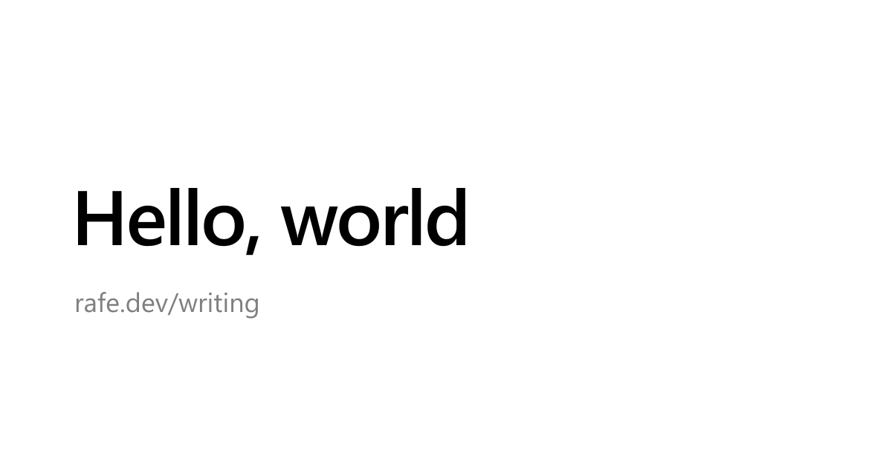
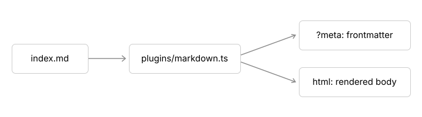

This post is a placeholder. It exists to show that a Markdown file in the repo comes out the other end as a fast, readable page, a link preview, and a feed entry.

## Code

Code blocks are highlighted at build time, so the page ships colored HTML and no highlighter:

```ts
const DATE_FORMAT = new Intl.DateTimeFormat('en-US', { dateStyle: 'long', timeZone: 'UTC' });

export function formatDate(date: string) {
	return DATE_FORMAT.format(new Date(date));
}
```

Inline code, like `import.meta.glob`, gets a quieter treatment. A block without a language stays plain:

```
pnpm dev
```

## Images

Relative images become build assets with their width and height set, so nothing shifts as they load. Rasters are re-encoded to a WebP srcset:



SVGs are served as they are:



### Everything else

- Lists, **bold**, _italic_, and ~~strikethrough~~
- [Links](https://github.com/rafeautie/shmoney), and bare ones like https://rafe.dev
- Headings with anchor links

> A blockquote, for when someone else said it better.

| Feature | Where it happens    |
| ------- | ------------------- |
| Parsing | build time          |
| Styling | the site stylesheet |
| Feed    | `/writing/feed.xml` |

And a footnote.[^1]

[^1]: Footnotes collect at the bottom of the post.
