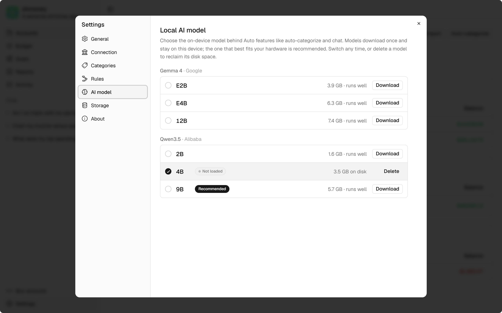

[shmoney](/shmoney) is my personal finance app. Everything lives in one SQLite file on your computer, and it uses a language model for two things: sorting transactions into categories, and a chat that answers questions about your money. The model runs on your computer too. Privacy was the whole reason, and I never considered a hosted API. An app that promises "no cloud, no account, no telemetry" can't turn around and send your transaction descriptions to someone else's server.

So the question was whether a model small enough to run on a normal machine could do anything useful with a bank history. It can, and most of the work went into taking jobs away from it and shaping the data so its first guess is usually the right one.

## Running it inside the app

Inference runs on [node-llama-cpp](https://node-llama-cpp.withcat.ai/), mostly because it packages with the app instead of running as a sidecar like Ollama. There's nothing extra to install. The model gets its own Electron `utilityProcess` so a llama.cpp crash can't take the UI down, it unloads after 60 seconds idle to give the RAM back, and every feature goes through one queue so two generations never fight over the same session.

Models download on demand from Hugging Face and get checked against a pinned hash. The picker filters them by total RAM and recommends the first one that passed my test battery, so a machine with room for Gemma 4 12B still gets Qwen3.5 9B. Qwen seems to understand how to piece tools together better, and it's better at working out what the user actually meant.



## Categorization

Categorization was the first LLM feature, and it set the rule I ended up following everywhere: don't ask a small model for anything code can guarantee.

The user's own rules run first since they're free and deterministic. What's left gets grouped by description, so a year of Netflix charges costs one generation. Transfers are never offered as a choice at all, because a separate detector pairs them by structure and a model guessing at them from descriptions would wreck every report.

The call itself is constrained to a JSON schema, which node-llama-cpp compiles into a grammar:

<!-- prettier-ignore -->
```ts
function buildSchema(categoryIds: number[]): object {
  return {
    type: 'object',
    properties: {
      reason: { type: 'string' },
      categoryId: { enum: categoryIds }
    },
    required: ['reason', 'categoryId']
  }
}
```

The `enum` means the answer is always a real category. Putting `reason` first makes the model write a few words before it picks. It's effectively an extremely slow [Jev](<https://en.wikipedia.org/wiki/Jev_(AI_model)>) implementation with a thinking step bolted on. That's also why categorization feels slower than chat: every merchant is a fresh generation that re-reads the whole category list. It runs in the background with a progress bar and one undo entry, so in practice it doesn't matter much.

## Teaching it SQL

The first version of the chat gave the model a read-only `query` tool and taught it SQL. Locking the database down was the easy part. Getting correct SQL out of a small model was not, and a few dozen July commits are me finding out how it went wrong.

Asked to compare June with July, it charted the daily rows correctly and then quoted June's first day as July's total. Category names like "🍽️ Dining Out" lost their emoji in its `WHERE` clause, so the filter matched nothing. The transaction date expression came back mangled three different ways. It did math in its head and stated the wrong answer as fact. Once, after a failed query, it just made up a plausible table of income and expenses, which is about the worst thing a finance app can do.

Telling it not to do these things in the prompt did very little. What worked was making its natural assumption true. The comparison query started repeating each month's total on every row, so the right number sat next to the one it kept grabbing. The date became a plain `txn_date` column. Arithmetic moved to a `calc` tool. A small model copies what it can see far better than it follows a rule, so the prompt turned into worked examples, and few-shot beat the other three prompt styles I tried by a wide margin.

## Typed tools

The problem was that all those rules and examples were eating the context window, and context is the thing you have least of on a consumer GPU. The chat runs in 12,288 tokens. A turn that retries a failed query has to hold the prompt, two queries and two result sets at once, and at 8K it simply overflowed. Every fix I added took room away from the conversation.

So in September the chat moved to typed tools: `totals`, `budgets`, `goals`, `recurring`, `balances`, `transactions`, `what_if` and `unusual`. Each one returns finished figures, with partial months, comparisons, recurring charges and goal pace all worked out in code. `query` is still there as a fallback. The schemas get rebuilt every turn from your data, so category and account names are grammar enums the model can't misspell. Asked how much went to eating out over the last three months, all it has to do is fill this in:

<!-- prettier-ignore -->
```ts
totals({
  measure: 'spending',
  by: 'none',
  split: 'none',
  period: 'last_3_months',
  compare_to: null,
  category: '🍽️ Dining Out',
  account: null,
  search: null,
  chart: 'auto'
})
```

This was about performance, capability and context more than anything. The prompt shrank, questions the SQL recipes never handled well started working, and the model's job came down to understanding the question and picking a tool, which it's good at. The same idea covers changes. The chat can propose recategorizing a merchant or moving a budget, but it only produces a card, and nothing happens until you click Apply.


_A scripted conversation from shmoney's demo dataset, built on the real `totals` tool._

## How well it works

With small models it's easy to convince yourself a prompt change helped when it broke two other questions, so I keep a fixed list of questions as a small benchmark, run against demo data with every figure checked against the database. It's small, but it gives me some level of data-driven measurement, and a model has to pass it before the picker recommends it.

I haven't measured tokens per second. It's fast enough. On my RTX 3080 FE the chat doesn't feel slower than the hosted models I use every day. The onboarding still labels it Experimental, more as expectation setting than anything. LLMs in general, especially small ones, are still an experiment, and I might drop the label.

## Building it with Claude

Most of the LLM work was written with Claude, and I'd rather be upfront about that. It started slow, especially early on while the architecture was being worked out, and I reviewed a lot. Now there's less review and more manual validation and testing on my part.

The prompt work was a good fit for an agent. The repo has a skill that drives the dev app over the Chrome DevTools Protocol, so Claude can ask the chat a question, check the answer against the database and report what went wrong. Watching a small model fail, finding the structural fix and re-running the battery is tedious, and Claude did most of it. How that changed over three months is probably its own post.

shmoney is [open source](https://github.com/rafeautie/shmoney) if you want to read the code.
